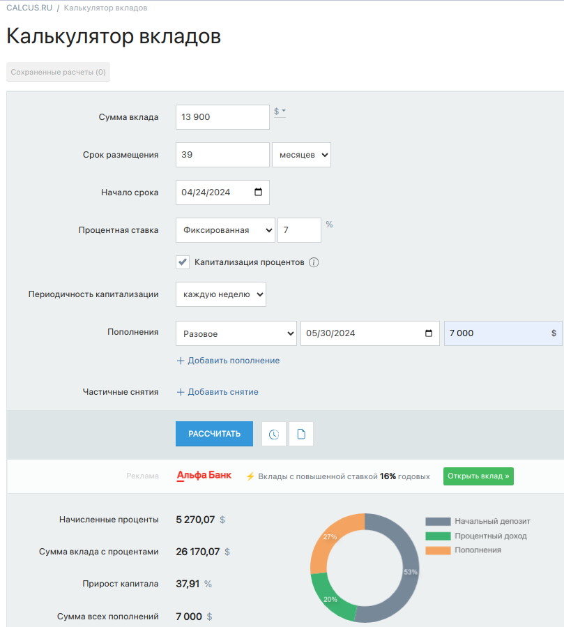

# Scientific-Deposit-Credit-Calculator

## Overview
Implementation of the extended version of the standard calculator in C++. 

### Scientific mode
This mode enables you to:
- Calculate arbitrary bracketed arithmetic expressions in infix notation;
- Substitute variable x with number in arithmetic expressions;
- Plot a graph of a function given by an expression in infix notation with the variable x;
- Plot multiple graphs of your choice;
- Plot random graphs (Batman, filled heart or empty heart);
- Scale graph;
- Change domain and codomain;
- Use buttons or keyboard for input;
- Adjust the sizes of GUI parts, such as enlarging input fields and resizing graph display areas;

### Credit mode:
This mode provides precise calculations similar to [calculus.ru](https://calcus.ru/kreditnyj-kalkulyator), enabling you to:
- Compute monthly payments accurately based on principal, interest rate, and flexible loan term inputs in months, days, or years;
- Determine the total interest paid over the loan duration for both differentiated and annuity loans;
- Visualize loan repayment scenarios through interactive graphs;
- Adjust the sizes of GUI parts, such as enlarging input fields and graph display areas and resizing output field;

### Deposit mode:
This mode provides precise calculations similar to [calculus.ru](https://calcus.ru/kalkulyator-vkladov), enabling you to:
- Calculate potential returns on your deposits with precision, considering principal, interest rate, tax rate, deposit replenishments, and partial withdrawals, with flexible term inputs in months, days, or years;
- Visualize deposit growth and interest accrual scenarios through interactive graphs;

## Installation 
Run `make all` or `make install` to install the program.

## Usage
Run `make run` to launch the GUI-based calculator.

<h2 align=center> Scientific Calculator </h2>

  <h3 align=center> Calculation </h3>
  

  <h3 align=center> Graph plotting </h3>
  
  
  
  

  <h3 align=center> Error handling </h3>
  
  

 
<h2 align=center> Credit Calculator </h2>

  <h3 align=center> Calculation of monthly payment, overpayment, and total payment on annuity loan</h3>
  
  
  <h3 align=center> Calculation of monthly payment, overpayment, and total payment on differentiated loan </h3>
  
  
  <h3 align=center> Error handling </h3>
  

<h2 align=center> Deposit Calculator </h2>

  <h3 align=center> Calculation of accrued interest, tax amount, and deposit amount by the end of the term </h3>
  
  
  <h3 align=center> Error handling </h3>
  

## Dependencies
This program depends on the following libraries:
- GTest (for tests)
- Qt 6 (for GUI)